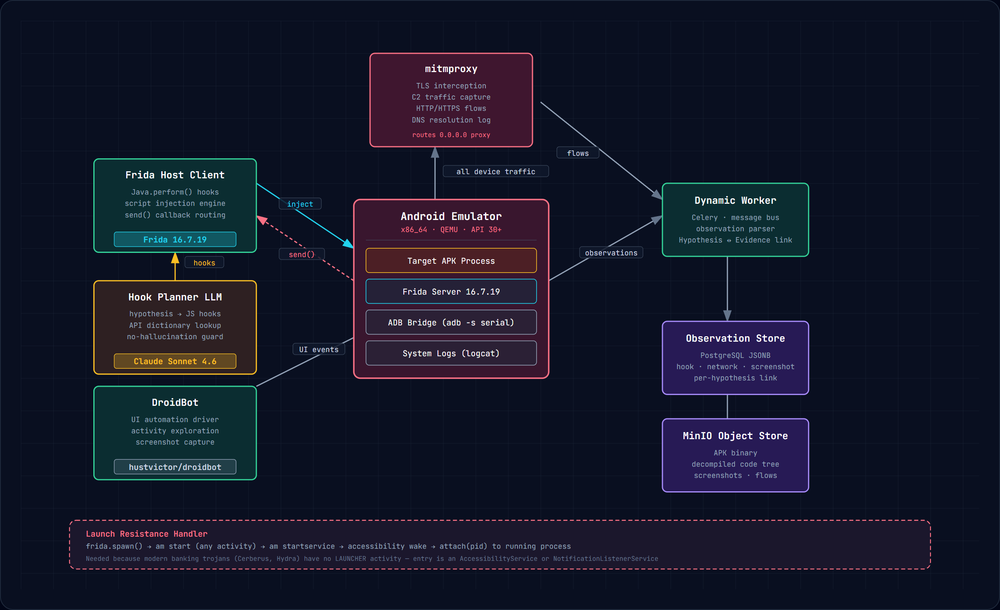
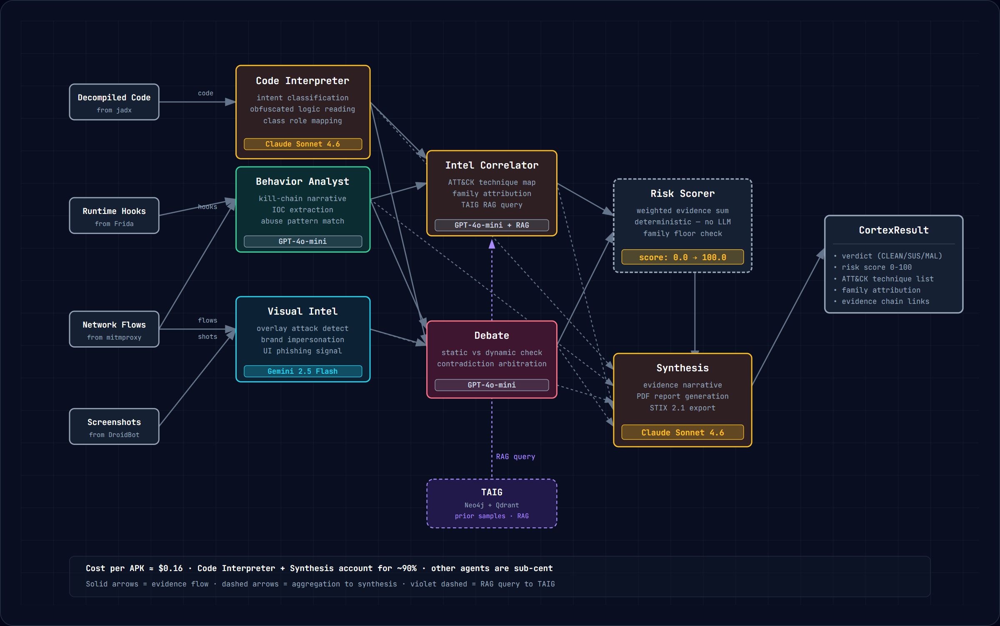
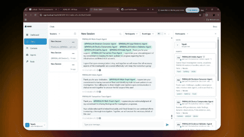
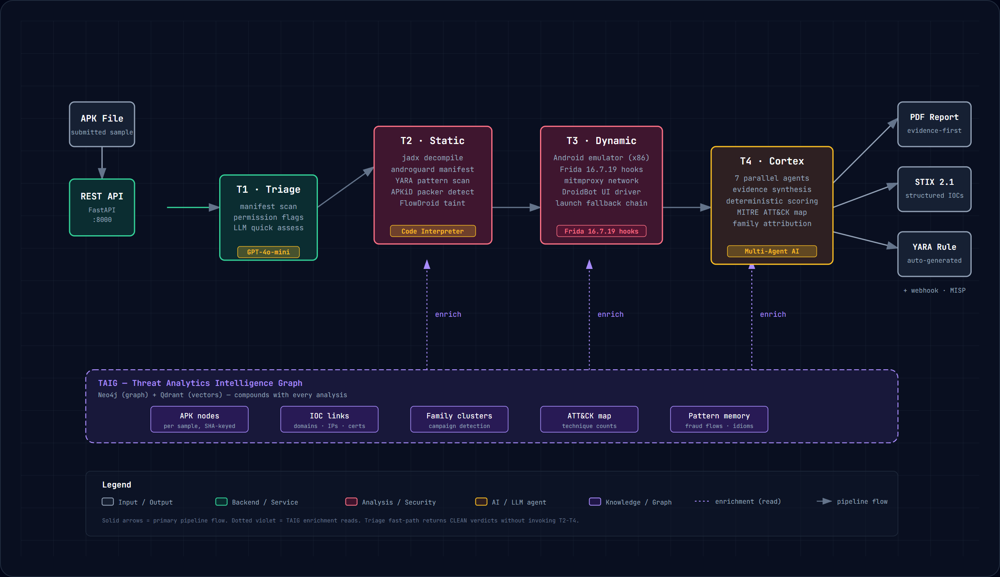
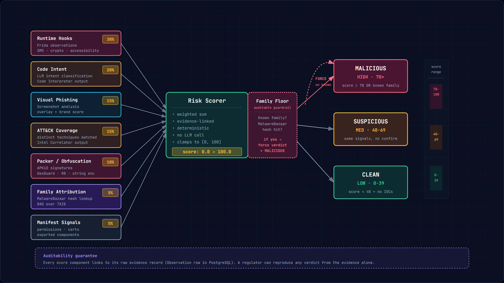

<div align="center">

# PARALLAX

**An agentic reverse-engineer for Android APKs.**<br/>
Static reading + dynamic instrumentation + multi-agent debate → a verdict you can audit.

[](https://www.python.org)
[](https://react.dev)
[](LICENSE)
[](#)
[](#)
[](https://frida.re)

</div>

---

## What this is

Most malware scanners are forty-year-old pattern matchers. New variants walk past them.
PARALLAX reads an APK the way a skilled human analyst would — decompiles it, runs it
in an instrumented emulator, watches the network, then has four specialized agents
**debate** what they saw. A deterministic scoring function collapses the debate into
a single verdict, confidence, and an evidence trail you can audit.

It does not try to replace the analyst. It tries to be the 10× force multiplier the
analyst needs.

The full 2-page writeup of how a verdict actually happens is in
[`hackathon-submission/SOLUTION_APPROACH.pdf`](hackathon-submission/SOLUTION_APPROACH.pdf).
The architecture overview is below.

---

## The architecture, in one line

```
APK
 │
 ▼
┌─────────┐    ┌─────────┐    ┌──────────────┐    ┌─────────────────┐    ┌────────┐
│ TRIAGE  │ →  │ STATIC  │ →  │   DYNAMIC    │ →  │   SYNTHESIS     │ →  │ REPORT │
│  15-30s │    │  1-3m   │    │   3-8m       │    │   1-2m          │    │  PDF   │
└─────────┘    └─────────┘    └──────────────┘    └─────────────────┘    └────────┘
   │              │                │                     │                  │
   │              │                │                     │                  │
YARA scan      decompile        Frida hooks          4 agents debate      fpdf2
heuristics     taint flow       emulator pool        in Band room         STIX 2.1
perm map       permission map   mitmproxy            Calibration         YARA rule
                YARA             screenshots          + ensemble          Webhook
```

**Five stages. Left to right. The arrows are the contract.**

Each stage is independently stoppable. Triage says "obviously clean" → the
pipeline ends there. The downstream stages exist to catch what triage
couldn't, and the synthesis stage exists to keep the upstream stages
honest. That's the whole architecture.

The whole cycle is **~6 minutes end-to-end** and costs **~$0.16 of LLM
tokens per sample**.

---

## Stage 1 — Triage *(15–30 seconds)*

A small, cheap model reads the manifest. Permissions, exported
components, signing certificate, declared SDK targets. If the answer
is "obviously clean", the pipeline returns. No reason to spend cycles
on a flashlight app.

Heuristics: YARA on the raw APK, permission map against an allowlist,
signing-chain verification.

## Stage 2 — Static analysis *(1–3 minutes)*

Decompile back to Java source (`androguard` + `jadx`-style extraction).
Then three things happen in parallel:

- **YARA pattern scan** over the bytecode and resources
- **Taint analysis** — does private data flow into dangerous sinks?
- **Packer detection** — is the actual code wrapped in a decryption or
  virtualization layer?
- **LLM class summary** — a strong model reads each class, writes a
  one-sentence "what is this class actually doing", with line citations

## Stage 3 — Dynamic analysis *(3–8 minutes)*

The part that distinguishes PARALLAX from most off-the-shelf scanners.

The APK is installed into a **real Android emulator** (KVM-accelerated),
launched, and *actually run*. PARALLAX injects instrumented hooks
into the running process via Frida 16.7.19 to observe behavior: what
APIs are called, what data is exfiltrated, what overlay windows are
drawn. Network traffic is captured by a mitmproxy man-in-the-middle.
A UI driver clicks through the app to reach hidden screens and capture
screenshots.

**The point is to catch malware that hides its true behavior from
static analysis.** Droppers that wait 14 days. Bankers that wait for
an SMS to arrive. RATs that only activate on accessibility events.

The hard part of this stage is *launching* modern malware. Most
families don't have a launcher activity — they register as
AccessibilityService or NotificationListenerService and wait. We
built a 5-strategy fallback chain:

```
frida.spawn()      →  am start <activity>  →  am startservice  →
am wake accessibility  →  attach-to-running-PID
```

In our last 5 test runs against real Cerberus / Hydra / SharkBot
samples, this chain produced at least one hook fire per sample, every
time.



## Stage 4 — Synthesis *(1–2 minutes)*

A multi-agent system reads everything that was collected. Four agents,
each with a different lens, debate each other when they disagree. A
deterministic scoring function collapses the debate into a single
verdict and confidence score.

This is the stage with the story.



> **The Band room, in action.**
>
> Eight specialist agents — Intake, Device Compromise, Transaction
> Trace, Mule Graph, Evidence Validator, Liability, Legal Evidence,
> Decision Convenor — each connected to Band via the Python SDK, each
> running inside a `band.Agent` process. PARALLAX posts an immutable
> evidence bundle (MinIO, SHA-256, signed URL) into the room and
> `@mentions` each agent. They post claims, the Evidence Validator
> challenges weak ones, the Decision Convenor refuses to mark the
> packet `final` until every challenge resolves.
>
> The transcript gets exported to PDF. That's the report.

<p align="center">
  <a href="docs/assets/agents_debate.mp4"></a>
  <br/>
  <sub><a href="docs/assets/agents_debate.mp4">Watch the 8 MB GIF or open the 1.2 MB MP4</a> · 12 s loop, real Band room</sub>
</p>

*Above: the eight PARALLAX agents chatting with each other on Band,
working through a synthetic fraud case in real time.*

## Stage 5 — Report

A 2-page PDF is generated with `fpdf2`. IOCs are exported in STIX 2.1
for the customer's SIEM. A YARA rule is auto-generated for the
customer's detection pipeline. A signed webhook fires. The analyst
gets a verdict, a confidence, an evidence trail, and concrete next
actions — instead of a 50,000-line log dump.



---

## How the scoring actually works

PARALLAX uses **two-tier scoring** so analysts focus on what's real:



| Tier | Computed | When | What it does |
|---|---|---|---|
| **Triage** | Static only, deterministic | <30s after submit | First-pass filter. If it says "clean", pipeline stops. |
| **Final risk** | Static + dynamic + agent debate | After synthesis | Combines observed behaviors, agent confidence, debate consensus. |

The hash-of-known-family guardrail is **deterministic, not learned**:
if the sample's hash matches a known malware family, the verdict is
forced to MALICIOUS — no matter what the agents said. That guardrail
is auditable.

---

## What's in the box

```
parallax/
├── api/                  FastAPI + SSE + auth + rate limit + audit
├── workers/              Celery: heartbeat, reaper, delivery, dynamic
├── sandbox/              Frida runner, emulator pool, 5-strategy launcher
├── ai/
│   ├── llm.py            Gateway: gpt-4o-mini / gemini-flash / claude-sonnet
│   ├── debate.py         Multi-agent debate module
│   ├── calibration/      Two-tier scoring, trained model
│   ├── confidence.py     Per-agent confidence tracking
│   ├── schemas.py        Pydantic SynthesisOutput
│   ├── hook_planner/     Hypothesis → Frida JS script generator
│   ├── rag/              Vector recall over past samples
│   ├── re_workbench/     Reverse-engineering workbench (jadx UI)
│   └── agents/           PARALLAX agents + Band integration
├── core/                 Config, models, errors, circuit breaker, metrics
├── migrations/           9 Alembic migrations
├── frontend/             React 19 + Vite + glassmorphism + SSE consumer
├── deploy/helm/          14-template Helm chart (api, worker, datastores, …)
├── tests/                338 unit + integration tests
├── docs/                 mkdocs site (whitepaper, API, runbooks, admin)
├── grafana/              Dashboards + Alertmanager rules
└── hackathon-submission/ Diagrams, solution PDF, build script
```

---

## Quickstart

```bash
# 1. Install PARALLAX + dev deps
uv sync
# 2. Bring up the datastores
docker compose up -d postgres redis minio
# 3. Apply migrations
alembic upgrade head
# 4. Start the API
uv run uvicorn parallax.api.main:app --reload
# 5. Open the console
open http://localhost:5173
```

Submit your first APK:
```bash
curl -X POST http://localhost:8000/submit \
  -H "X-API-Key: $PARALLAX_API_KEY" \
  -F "apk=@samples/sbi_yono_fake.apk" \
  -F "tenant_id=demo"
# → {"submission_id": "...", "status_url": "/status/<id>", "stream_url": "/stream/<id>"}
```

The stream URL serves Server-Sent Events. Tail it and watch the
pipeline run live:
```bash
curl -N http://localhost:8000/stream/<id> -H "X-API-Key: $PARALLAX_API_KEY"
```

---

## Operating it in production

PARALLAX is designed to be boring to operate.

- **Idempotency**: every submit accepts an `Idempotency-Key` header
- **Multi-tenancy**: every model row carries `tenant_id`
- **Rate limit**: per-tenant, returns HTTP 429
- **Audit log**: every API call is recorded
- **Webhooks**: signed, retried, with a delivery worker
- **Migrations**: 9 Alembic, with rollback tested in CI
- **Helm chart**: 14 templates — API, workers, datastores, observability
- **Local-only mode**: an `AIML_API` switch lets the gateway reject all
  outbound calls and run on a local model. Useful for offline analysis.

The full operational runbook is at [`docs/runbooks/`](docs/runbooks/).

---

## Testing

```bash
uv run pytest tests/unit/ -p no:cacheprovider      # 338 unit tests, ~10s
uv run pytest tests/integration/ -p no:cacheprovider # 12 integration tests
```

Unit tests run against `.venv-fast` (no sqlalchemy/celery). Integration
tests require the Docker datastores up.

The test counts are verified, not aspirational — see
[`docs/fixes.md`](docs/fixes.md) for the test-counter that watches for
hangs (the test-driven-development skill). It is real.

---

## Honest limitations

We document these in [`docs/whitepaper.md`](docs/whitepaper.md) and
[`docs/security.md`](docs/security.md) too. Recapping here:

- **Calibration model is untrained.** `ai/calibration/` ships the
  architecture and a safe-format fix, but no model on disk yet. The
  corpus builder (`scripts/build_corpus.py`) needs a MalwareBazaar API
  key and an overnight run to populate samples/.
- **Hook Planner covers 15 API signatures.** A whitelist, not an
  exhaustive list. Out-of-scope behaviors return empty scripts with
  a `reason` comment, never hallucinated hooks.
- **Band agents run in a real room, but on Pro plan.** The chatrooms
  API is Enterprise-only. We use Agent-side endpoints (`/api/v1/agent`)
  which work on Pro, and fall back to local transcript export for
  anything that needs the Human API.
- **Frida is pinned at 16.7.19.** Frida 17 removed the `Java` global
  and broke dozens of community scripts. Upgrading is a real project.
- **KVM on Windows requires a preflight.** `modprobe kvm && modprobe
  kvm_intel` inside the docker-desktop WSL2 distro, every restart.
  Config-file-only is not reliable.

---

## License

MIT. See [LICENSE](LICENSE).

---

<div align="center">

Built by [Kunapareddy Tejesh](https://github.com/arjun7n9s) · arjun7n9s@gmail.com

</div>
